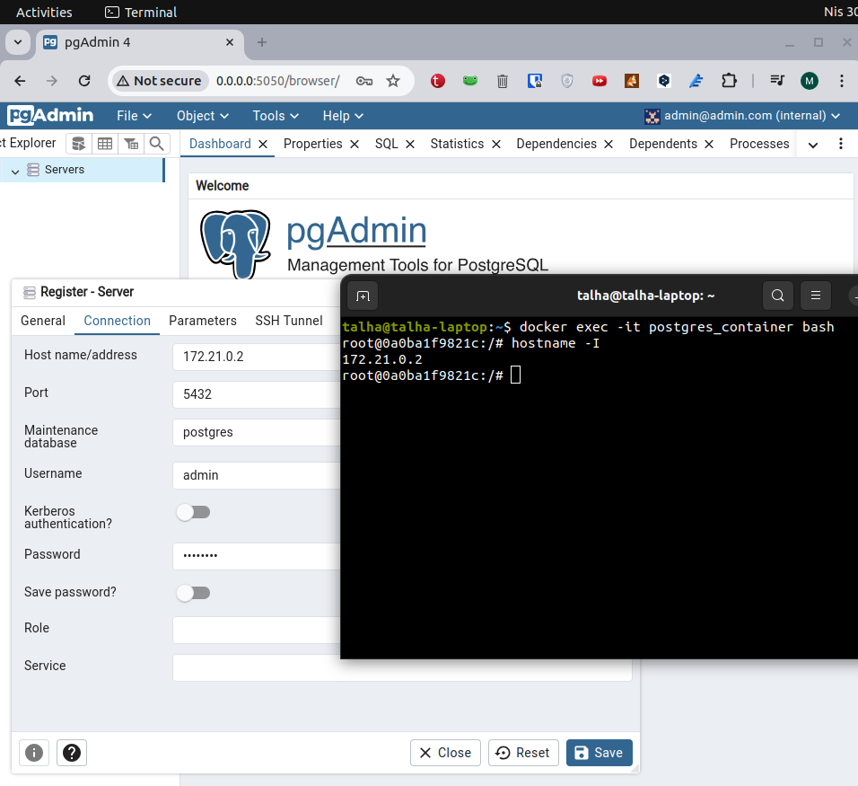

# eCommerce 
### Django - Postgresql - Tailwindcss

#### tools used

- Docker Compose version v2.24.6-desktop.1
- node v20.0.0
- npm v10.5.0
- images 
    - postgresql image: postgres:14
    - pgadmin image: dpage/pgadmin4
    - Django FROM python:3.9

#### all you have to do is just
#### `docker compose up`

> 0.0.0.0:8000 django views
> 0.0.0.0:5050 pgadmin4

##### connect to pgadmin4

Enter the e-mail and password specified at 0.0.0.0.0:5050
Create a server from pgadmin4 page and connect with postgresql_container ip

##### for tailwind

For the tailwind classes you wrote to be created in output.css;

`npx tailwindcss -i input.css -o output.css --watch`